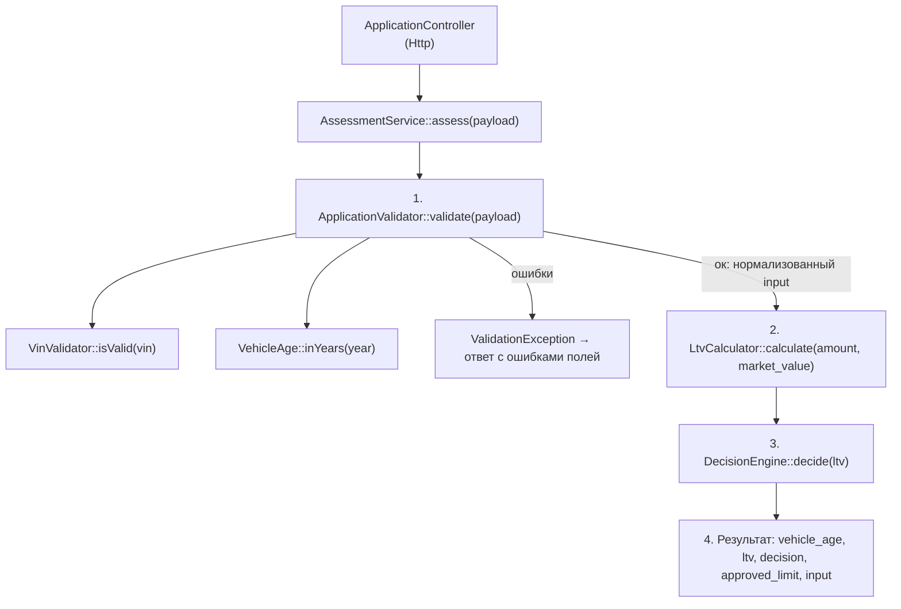

# Карта кода: как считается решение approve / review / reject

Разобраны `backend/src/Domain/` и `backend/config/rules.php`.

## Сборка (кто кому что передаёт)

`backend/src/AppFactory.php` (строки 27–39) один раз подключает `backend/config/rules.php` и собирает граф объектов:

- `VinValidator($rules['vin'])` — длина 17, запрещённые I/O/Q;
- `ApplicationValidator($rules, VinValidator, VehicleAge)` — весь справочник правил передаётся сюда;
- `DecisionEngine($rules['ltv'])` — только пороги `approve_max` / `review_max`;
- `LtvCalculator` — без конфига;
- `VehicleAge((int) date('Y'))` — текущий год для расчёта возраста;
- всё это — в конструктор `AssessmentService`, который достаётся `ApplicationController` (HTTP-слой).

## Пайплайн одного запроса



По шагам:

1. **`ApplicationValidator::validate($payload)`** (`ApplicationValidator.php:24`) — нормализует и проверяет поля по `rules.php`: VIN (через `VinValidator::isValid`), год (`min_year` = 1990, возраст 0…`max_age_years` = 20 через `VehicleAge::inYears`), пробег (0…`max_mileage_km` = 500 000), `market_value` > 0, сумму (`amount.min/max`), срок (`term.min/max`). Любая ошибка → `throw ValidationException` (строка 72), до LTV дело не доходит. Иначе возвращает нормализованный массив `{vin, year, mileage, market_value, requested_amount, term_months}`.
2. **`LtvCalculator::calculate($input['requested_amount'], $input['market_value'])`** (`LtvCalculator.php:15`) — LTV в процентах с двумя знаками: `round(amount / market_value * 100, 2)`.
3. **`DecisionEngine::decide($ltv)`** (`DecisionEngine.php:30`) — единственное место, где рождается решение:
   - `$ltv < approveMax (60.0)` → `APPROVE`;
   - `$ltv <= reviewMax (85.0)` → `REVIEW`;
   - иначе → `REJECT`.
4. **`AssessmentService::assess()`** (`AssessmentService.php:35–41`) собирает ответ: `vehicle_age` (повторный вызов `VehicleAge::inYears`), `ltv`, `decision`, `approved_limit` (равен запрошенной сумме при `approve`, иначе 0).

Замечание по границе: комментарии в `rules.php:39` и докблоке `DecisionEngine.php:10` обещают `LTV <= approve_max -> approve`, но код в строке 32 использует строгое `<`. То есть LTV ровно 60.0 даёт `review`, а не `approve`. Код — источник истины; расхождение с комментарием фактически есть.

## Правило «пробег > 400 000 км → review»: куда встанет

Куда не надо: в `ApplicationValidator`. Это валидатор — его ошибка означает `ValidationException` и отказ без решения, а 400 000 не выходит за допустимые 0…500 000. Новое правило — не запрет, а понижение решения, это логика решения, а не валидации.

Куда встаёт: `AssessmentService::assess()`, сразу после строки 33 (`$decision = $this->decisionEngine->decide($ltv);`):

```php
if ($input['mileage'] > $порог && $decision === DecisionEngine::APPROVE) {
    $decision = DecisionEngine::REVIEW;
}
```

`approved_limit` в строке 39 при этом автоматически станет 0 — согласовываться не нужно. Альтернатива — расширить `DecisionEngine::decide()`, но сейчас его сигнатура `decide(float $ltv): string`, конструктор хранит только два порога, а докблок прямо говорит «решение на основании LTV»; пришлось бы менять и сигнатуру, и конструктор.

Что для этого уже есть:

- `$input['mileage']` — нормализованное целое значение пробега уже возвращается из `validate()` (`ApplicationValidator.php:78`) и доступно в `assess()` (строка 32);
- константа `DecisionEngine::REVIEW` и логика `approved_limit` для не-approve уже существуют;
- валидация гарантирует, что до этой точки пробег лежит в [0, 500 000], то есть правило сработает только для диапазона 400 001…500 000.

Чего не хватает:

- самого числа 400 000 в конфиге — в `rules.php` есть только `vehicle.max_mileage_km` = 500 000, и это другая семантика (граница валидации, а не порог решения); по конвенции проекта порог нужно добавить в `rules.php`, например ключ в секции `vehicle`;
- доставки порога до места решения — конструктор `AssessmentService` не получает `$rules` вообще (только четыре объекта, строки 16–22), порог придётся прокинуть новым параметром конструктора (и передать в `AppFactory.php:30`) либо убрать внутрь `DecisionEngine`;
- механизма «понижения» решения — сейчас решение вычисляется одним вызовом по LTV, никакой корректировки решения в коде нет.

## Что уже сейчас проверяется про пробег

- `ApplicationValidator.php:43–46` — приведение к `(int)`, отсутствие поля трактуется как `-1` (то есть ошибка), проверка диапазона `0 <= mileage <= rules['vehicle']['max_mileage_km']` (500 000); при нарушении — ошибка поля `mileage` и `ValidationException`.
- Нормализованный пробег возвращается в `$input['mileage']` (строка 78) и попадает в ответ `assess()`.
- За пределами Domain: `ApplicationRepository.php:38–45` просто сохраняет пробег в таблицу `vehicles.mileage_km` — это хранение, не правило.

Всё остальное про пробег — влияние на LTV, на решение, на лимит — в коде нет: `LtvCalculator` и `DecisionEngine` про пробег не знают, ключа с порогом 400 000 в `rules.php` нет.